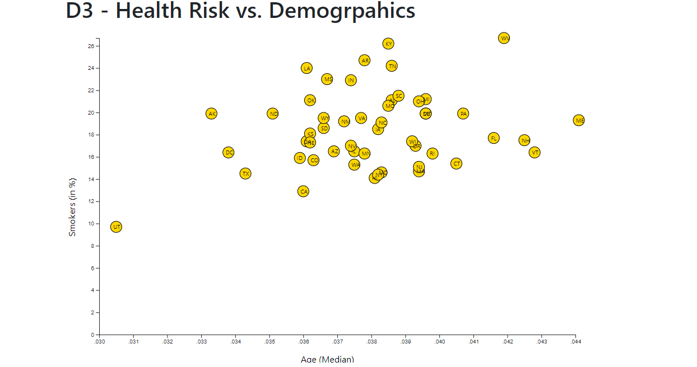

# D3-Health-by-Demographics

By utilizing *d3.js*, this html page visualizes the health risks facing particular demographics based on [2014ACS 1-year estimates](assets/data/data.csv). The current data set includes data on rates of income, obesity, poverty, etc. by state. The page displays scatter plot for Poverty vs Healthcare. Each state should be represented with circle elements with state abbreviations  using an *app.js*.

### Tech Stack
* JavaScript
* D3
* CSS
* HTML

### User Instructions
* Clone the repository: git clone https://github.com/Vincent-glitch/D3-Health-by-Demographic.git
*  In command: python -m http.server 
*  In web browser: http://localhost:8000/

 
